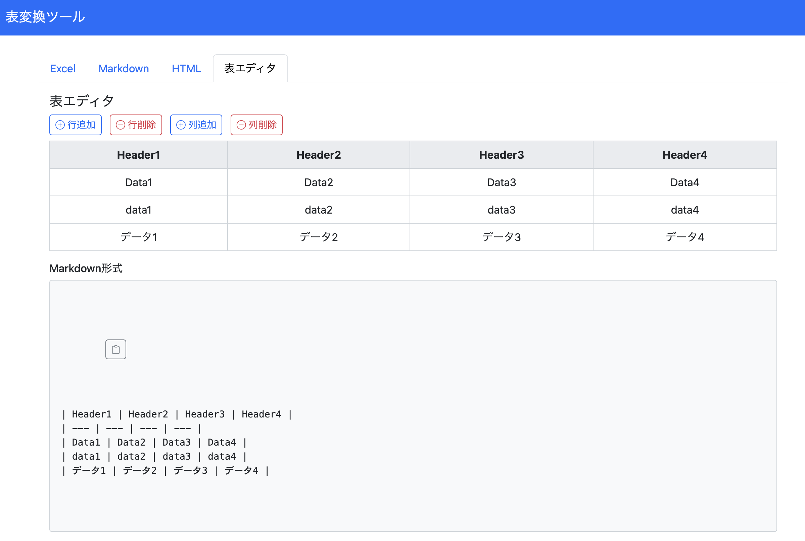

# Simple Web Applications

## 写真で振り返る 思い出旅行マップ

詳細

- このアプリケーションは、ユーザーが撮影した写真のGPS座標、撮影日時などのEXIF情報を活用して、旅行の思い出を地図上に視覚的に楽しむことができることを目的としたものです。
- また、今後の旅行計画を作る際にメモを地図上に残しておきたいという要望から、マーカーを手動で追加できるようにしています。
- 写真の位置情報をもとに自動クラスタリングを行い、グループ単位で管理および表示することで、ユーザーは訪れた地域ごとに旅行を写真と共に振り返ることができます。

### 特徴

- 写真のEXIF情報解析
    - アップロードされた画像ファイルからEXIF情報を抽出し、GPS座標や撮影日時、ファイルパスなどのメタデータを利用して地図上に配置します。
- 自動クラスタリング
    - 写真同士の位置が一定の閾値以内であれば同じグループ（クラスタ）にまとめ、グループごとの中心座標を動的に再計算します。
- 逆ジオコーディング
    - Nominatim API と BigDataCloud Reverse Geocoding API を利用して、GPS座標から都市名や地域名を取得します。
    - 有効な都市名が取得できない場合は、自動的に「グループ1」「グループ2」…とグループ名を付与します。
    - 自動的に付与された仮のグループ名は一度に限り変更が可能です。
- 地図表示（Leaflet, OpenStreetMap）
    - Leafletを利用して、地図上に各写真のマーカーを個別に表示します。
    - 各グループの範囲は、グループ内の全写真の位置から計算した最大距離をもとに、薄い青色で円を描画して示しています。
- シンプルなUI
    - サイドパネルには「グループ名 (枚数)」の形式でグループ一覧を表示しています。
    - グループをクリックすると、対応するグループの平均座標に地図が移動し、右上の詳細表示エリアにはそのグループに属する写真を表示します。
    - 写真詳細表示では、左右の「<」「>」ボタンおよびキーボードの左右矢印キーで写真を切り替えることができます。
    - 写真の下部には、EXIF情報（座標、撮影日時、ファイルパス）も表示されます。
- データの永続化・インポート／エクスポート
    - ブラウザのlocalStorageを利用して、ユーザーが登録した写真に付随するデータを保持します。
    - JSON形式およびCSV形式でのデータの書き出し・読み込み機能を備え、バックアップや他環境での再現が容易です。
- ダークモード対応
    - お好みでボタンや背景、文字の色をダークテーマ用に調整したダークモードとライトモードを切り替え可能です。
- コメント機能
    - コメント編集ボタンを押すと、それぞれのグループに対してメモを記入することができます。

### 使用している技術・ライブラリ

- HTML5/CSS3/JavaScript
    - JavaScriptの基本機能（async/await、Promise、イベントリスナーなど）を使用して、非同期処理やユーザーインタラクションを実装しています。
- Leaflet.js
    - インタラクティブな地図表示、マーカーおよび円の描画に利用しています。
- EXIF.js
    - 写真からEXIF情報を抽出します。
- 逆ジオコーディングAPI
    - [axios](https://github.com/axios/axios) : 逆ジオコーディングAPIへのHTTPリクエストを実行するために使用しています。
    - [Nominatim API](https://nominatim.org/release-docs/latest/api/Overview/)
    - [BigDataCloud Reverse Geocoding API](https://www.bigdatacloud.com/free-api/free-reverse-geocode-to-city-api)
- Web Storage API ([localStorage](https://developer.mozilla.org/ja/docs/Web/API/Window/localStorage))
    - ユーザーデータの永続化に使用します。
- Flexbox
    - 地図部分とサイドパネルのレイアウトを柔軟に実現します。

### セットアップとインストール

- プロジェクトのファイル一式（HTML、CSS、JavaScriptファイル）をWebサーバーまたはローカル環境に配置します。
- 本アプリケーションはクライアントのみで動作するため、サーバーの設定は不要です。
- 配置したHTMLファイルにブラウザでアクセスすると、アプリケーションが起動します。

### 使い方

- 上部の「ファイル選択」ボタンから複数の写真を選択し、EXIF情報が抽出されると「登録」ボタンが有効になります。
- 「登録」ボタンをクリックすると、写真ごとにEXIF情報からGPS座標などを取得し、地図上にマーカーとグループ範囲が表示されます。
- 各グループは、逆ジオコーディングにより取得した都市名（または自動生成された「グループX」）で表示され、写真が近い場合は自動的にクラスタリングされます。
- 右側のサイドパネルにグループ一覧が表示され、「グループ名 (総写真枚数)」の形式で一覧表示されます。
- グループをクリックすると、地図がそのグループの平均座標に移動し、下部の詳細表示エリアにグループ内の写真が表示されます。

- 詳細表示エリアでは、左右の「<」「>」ボタンおよびキーボードの左右矢印キーで写真を切り替えられ、各写真のEXIF情報（座標、撮影日時、ファイルパス）も確認できます。

- 写真を詳細表示エリアでクリックすると画面に大きくポップアップされた写真を表示します。
- 手動マーカー追加：地図上をクリックして、手動でマーカーを追加することも可能です。
- データのインポート／エクスポート：JSONまたはCSV形式で旅行記録データを保存・読み込みできます。
- ダークモード切替：上部の「Dark Mode」ボタンでテーマを切り替え、暗い環境でも見やすく利用できます。

### 不具合

- 書き出したcsvファイルまたはjsonファイルを読み込んだ際に、写真ファイルがURLで指定される状況にない場合、地図上のピンとメタデータは復元されますが、写真が読み込まれないことが確認されています。

## Simple Web Calendar

詳細

- このアプリケーションは、ユーザーがブラウザ上で予定の追加・編集・削除、メモの管理、CSV 形式でのデータのインポート／エクスポートなどを行える、シンプルかつモダンなカレンダーアプリです。
- サーバーサイドのプログラムを一切使用せず、HTML と JavaScript のみで動作するため、ローカル環境でも簡単に利用可能です。

---

### 機能の紹介

使い方(前編)

- 予定の追加は標準的なカレンダーと同様で直感的に操作できます。
- 日付はカレンダー形式(date)から選択でき、時刻はスクロール形式(time)から入力できます。
- 関連予定を複数紐付けることが可能です。紐づける際にはidを直接指定するほか、キーワード検索することが可能です。
- 地図から場所を選択して位置情報を追加することが可能です。
- バッジの色を変更可能です。
- 重要度に応じて文字サイズを変更可能です。
- ユーザ定義のタグを含め、複数タグをサポートします。

---

使い方(後編)

- 日付順または優先度順でソートすることができます。
- 終了済みイベントを非表示にすることができます。
- 予定イベントをキーワード検索することが可能です。
- 編集可能な複数のメモを記録可能です。
- 文字サイズ/バッジ色のデフォルトを優先度別で設定可能です。
- お知らせボタンをクリックすると今日の予定が優先度順に表示されるほか、インポート・エクスポート履歴、設定変更履歴を確認できます。
- csvファイルでエクスポート/インポートが可能です。全ての予定イベント、設定情報、メモ帳を完全にエクスポート/インポートします。
- 全ての項目において既存の予定の編集が可能です。
- リスト表示時に座標をクリックすることで地図にピンを表示することができます。

## 表変換ツール

詳細

- このアプリケーションは、csv, excel, markdown, htmlを相互に変換するツールです。
- エディターで表を作成し、csv, markdown, htmlの書式でコピーすることが可能です。

### 特徴

- 複数入力形式への対応
	- ExcelとCSVファイルのアップロードにより表データを読み込み、MarkdownおよびHTML形式に変換できます。
	- Markdown形式のテーブル入力から、HTMLやCSV形式に変換できます。
	- HTML形式のテーブル入力から、MarkdownやCSV形式に変換できます。
- 「表エディタ」タブでの画面上で直接編集可能なテーブル（contenteditable 属性を使用）
	- 行・列の追加・削除ボタンにより簡単に表のサイズを変更できます。
	- HTMLでの変換結果表示では、「HTMLタグでの出力」と「レンダリングされたプレビュー」の両方で表示しています。
- その他のこだわりポイント
    - ワンボタンでのコピー機能を提供しています。
	- csvファイルを読み込んだ際にでの入力出力文字コードの指定を可能にしています。
    - リアルタイムに更新されるように設計しています。

### 使用している技術・ライブラリ

- Bootstrap 5, Bootstrap Icons (UI, https://getbootstrap.com/docs/5.0/extend/icons/)
- SheetJS (xlsx用ライブラリ, 2025年2月に0.20.3に変更, https://sheetjs.com/)
- encoding.js (テキスト変換処理, https://github.com/polygonplanet/encoding.js/blob/master/README_ja.md)

