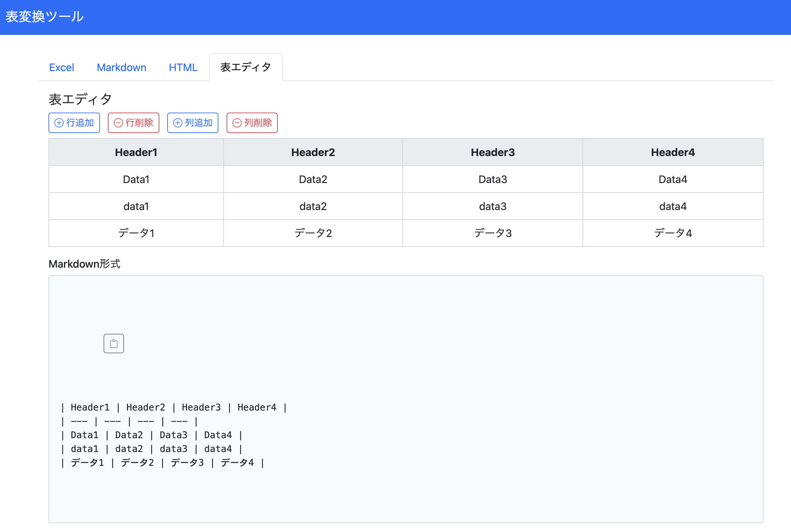

## 表変換ツール

- このアプリケーションは、csv, excel, markdown, htmlを相互に変換するツールです。
- エディターで表を作成し、csv, markdown, htmlの書式でコピーすることが可能です。

### 特徴

- 複数入力形式への対応
	- ExcelとCSVファイルのアップロードにより表データを読み込み、MarkdownおよびHTML形式に変換できます。
	- Markdown形式のテーブル入力から、HTMLやCSV形式に変換できます。
	- HTML形式のテーブル入力から、MarkdownやCSV形式に変換できます。
- 「表エディタ」タブでの画面上で直接編集可能なテーブル（contenteditable 属性を使用）
	- 行・列の追加・削除ボタンにより簡単に表のサイズを変更できます。
	- HTMLでの変換結果表示では、「HTMLタグでの出力」と「レンダリングされたプレビュー」の両方で表示しています。
- その他のこだわりポイント
	- ワンボタンでのコピー機能を提供しています。
	- csvファイルを読み込んだ際にでの入力出力文字コードの指定を可能にしています。
	- リアルタイムに更新されるように設計しています。

### 使用している技術・ライブラリ

- Bootstrap 5, Bootstrap Icons (UI, https://getbootstrap.com/docs/5.0/extend/icons/)
- SheetJS (xlsx用ライブラリ, 2025年2月に0.20.3に変更, https://sheetjs.com/)
- encoding.js (テキスト変換処理, https://github.com/polygonplanet/encoding.js/blob/master/README_ja.md)

